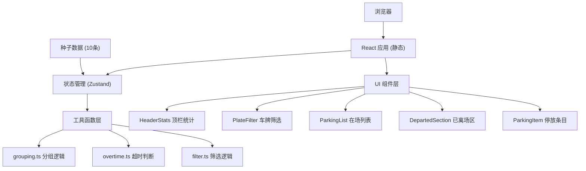

## 1. 架构设计



## 2. 技术描述

- 前端：React@18 + TypeScript + Vite@5 + TailwindCSS@3
- 状态管理：Zustand@4
- 图标库：lucide-react
- 无后端，纯前端静态应用
- 数据：10 条种子停放记录，前端状态管理
- 部署：Docker + Nginx 静态托管

## 3. 目录结构

```
├── src/
│   ├── components/
│   │   ├── HeaderStats.tsx      # 顶栏统计组件
│   │   ├── PlateFilter.tsx      # 车牌筛选组件
│   │   ├── ParkingList.tsx      # 在场列表组件
│   │   ├── ParkingItem.tsx      # 单条停放记录组件
│   │   └── DepartedSection.tsx  # 已离场折叠区组件
│   ├── utils/
│   │   ├── grouping.ts          # 在场/离场分组逻辑
│   │   ├── overtime.ts          # 超时判断逻辑
│   │   └── filter.ts            # 车牌筛选逻辑
│   ├── store/
│   │   └── useParkingStore.ts   # Zustand 状态管理
│   ├── data/
│   │   └── seedData.ts          # 10条种子数据
│   ├── types/
│   │   └── parking.ts           # 类型定义
│   ├── App.tsx
│   ├── main.tsx
│   └── index.css
├── Dockerfile
├── nginx.conf
├── package.json
├── tsconfig.json
├── vite.config.ts
└── tailwind.config.js
```

## 4. 类型定义

```typescript
interface ParkingRecord {
  id: string;
  plateSuffix: string;      // 车牌尾号后两位
  visitingResident: string; // 来访住户
  entryTime: Date;          // 驶入时间
  allowedUntil: Date;       // 允许停放至
  isDeparted: boolean;      // 是否已离场
  departedAt?: Date;        // 离场时间
}

interface ParkingStats {
  currentCount: number;     // 当前在场数
  overtimeCount: number;    // 超时数
  todayDeparted: number;    // 今日累计离场数
}
```

## 5. 核心模块说明

### 5.1 overtime.ts - 超时判断
```typescript
// 判断单条记录是否超时
export function isOvertime(record: ParkingRecord, now: Date = new Date()): boolean

// 批量获取超时记录
export function getOvertimeRecords(records: ParkingRecord[]): ParkingRecord[]
```

### 5.2 filter.ts - 筛选逻辑
```typescript
// 根据车牌尾号后两位筛选
export function filterByPlateSuffix(
  records: ParkingRecord[],
  suffix: string
): ParkingRecord[]
```

### 5.3 grouping.ts - 分组逻辑
```typescript
// 按在场/离场分组
export function groupByStatus(records: ParkingRecord[]): {
  active: ParkingRecord[];
  departed: ParkingRecord[];
}

// 在场列表按驶入时间倒序
export function sortByEntryTimeDesc(records: ParkingRecord[]): ParkingRecord[]
```

### 5.4 种子数据
10 条停放记录，包含：
- 6 条在场记录（其中 2 条超时）
- 4 条已离场记录（今日）
- 涵盖不同车牌尾号、来访住户、时间组合

## 6. Docker 配置

- 基础镜像：node:18-alpine（构建阶段）
- 运行镜像：nginx:alpine
- 暴露端口：80
- 构建产物：dist/ 目录复制到 nginx html 目录
- nginx 配置：单页应用路由回退 + gzip 压缩
